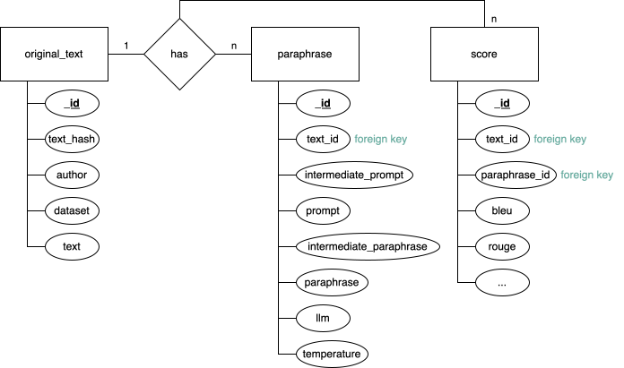
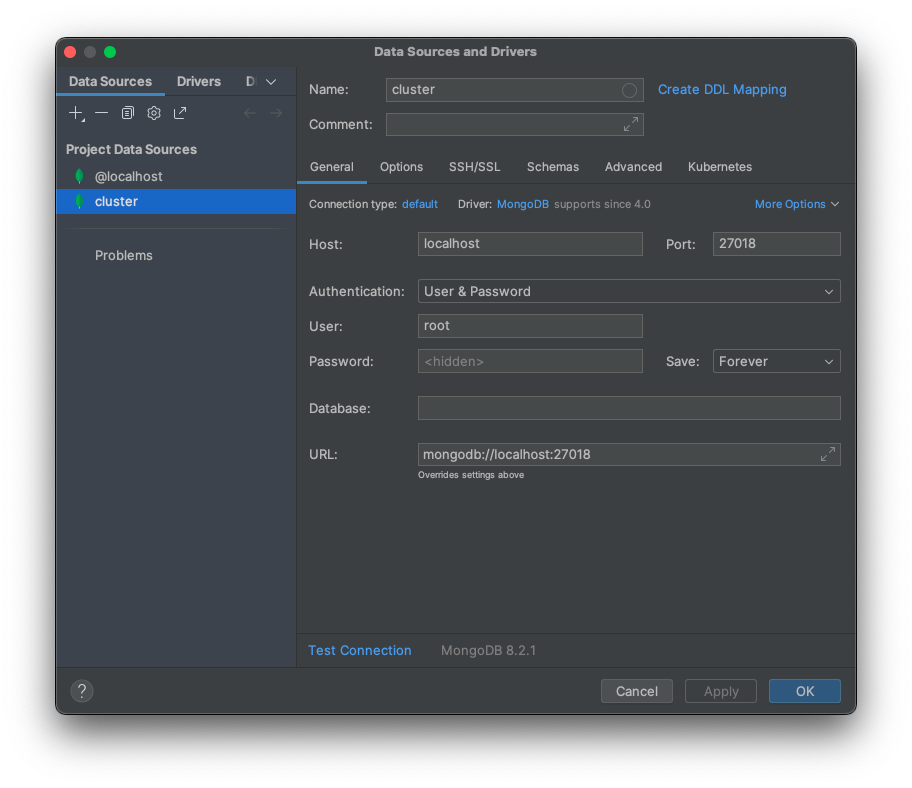
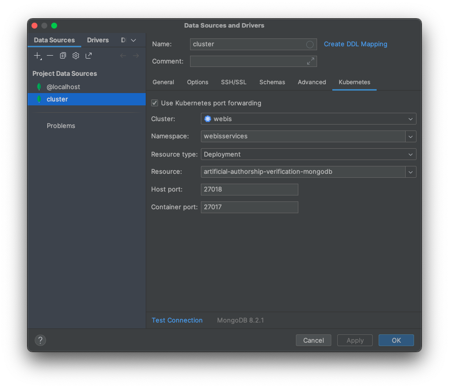

# artificial-authorship-verification
This repository contains the code associated with my Master thesis about authorship verification of artificial-generated texts and human-authored texts.
_Section with an asterisk * are generated with the help of ChatGPT._

## Contents
WIP: What did I do in this thesis?

Feel free to explore my written thesis [here as soon as public](https://github.com/KlaraGtknst/master-thesis).

## 🚀 Getting Started*

The project uses [**Poetry**](https://python-poetry.org/) for dependency management and packaging. 
[**Poetry**](https://python-poetry.org/) is a modern Python tool for **dependency management** and **packaging**. 
It replaces tools like `pip`, `virtualenv`, and `setuptools` with a single, streamlined workflow.

#### 🔧 Key Benefits*

- Manages dependencies via `pyproject.toml`
- Automatically creates isolated virtual environments
- Simplifies package building and publishing
- Provides a clean CLI for common tasks (`install`, `add`, `build`, etc.)


### ✅ Requirements*

- **Python ≥3.10 and <3.13**
  - Word Mover's Distance (WMD) requires Python <3.13, I use Python 3.11.9
- **Poetry ≥1.3**
- **Torch**
  - MacOS does not work with torch's cpu wheel. Ensure you have `torch = { version = "^2.5.0", source = "pypi" }
  torchvision = { version = "^0.20.0", source = "pypi" }
  torchaudio = { version = "^2.5.0", source = "pypi" }` in your `pyproject.toml` to install from PyPI instead of the default source.

Install poetry using the following command for MacOS:

```bash
brew install poetry
```

For the paraphrasers used in the impostor generation, you need to set up the following API keys in your `.env` file:
- [DEEPL_KEY](https://www.deepl.com/) (for Translation via DeepL: 500,000 characters/month in free plan)
- [SAIA_KEY](https://services.kisski.de/services/en/service/?service=2-02-llm-service.json) (for SAIA paraphraser models hosted by GWDG)
- [OPENAI_KEY](https://llm.web.webis.de/) (for OpenWebUI models hosted by Webis)
- [SERPAPI_KEY](https://serpapi.com/users/sign_up) (for Google search API: 250 queries/month in free plan)

### ⚙️ Set up the project*
1. Clone the repository
2. Navigate to the project directory: `cd artificial-authorship-verification`
3. Install the dependencies using Poetry:
   ```bash
   poetry install
   ```

### 🛠️ Common Poetry Commands*
- Add a new dependency:
  ```bash
  poetry add <package-name>
  ```
- Update dependencies:
  ```bash
  poetry update
  ```


# 🗂️ Datasets

Before you can run the code, you need to download the datasets and place them in the `data/datasets` directory.
The datasets need to be converted to the Hugging Face dataset format.
After downloading the datasets defined in the following, and adding them as described below, you can use the provided script `genai_detection/dataset_util` to convert them.
Note that you have to comment dataset methods you do not need at the bottom of the script, and run the script to convert the datasets.

## 📁 Current datasets
- **Cross-Discourse PAN23**: [PAN23 dataset](https://pan.webis.de/clef23/pan23-web/author-identification.html#data) (Request access at Webis group)
  - Request access at [FoLD webpage](https://fold.aston.ac.uk/handle/123456789/17)
  - Cross-Discourse Type AV (e.g. essay vs. email) PAN@CLEF2023.
  - Contains pairs of texts with authorship information.
  - The dataset is in JSONL format.
- **Koppel et al. (2014)**: [Blog Authorship Corpus](https://www.kaggle.com/datasets/rtatman/blog-authorship-corpus?resource=download)
  - Contains blog posts with authorship information.
  - The dataset is in CSV format.
- **Koppel et al. (2014) Student Essays**: not publicly available
  - Contains student essays with authorship information.
- **Fanfiction (PAN20)**: [PAN20 dataset](https://zenodo.org/records/5106099) 
  - Contains fanfiction texts with authorship information.
  - The dataset is JSONL format.
- **Gutenberg**: [Gutenberg dataset](https://www.gutenberg.org/)
  - Contains texts from the Gutenberg project with authorship information.
  - The dataset is in TXT format.
- **Student Essay**: 
  - Contains 7052 student essays from 2006 across 6 tasks.
  - The dataset is a selection of TXT, SAV and DAT files.
  - Contact James W. Pennebaker for access to the dataset.

## 📁 Add a new dataset
To add a new dataset, create new directories in the `data/datasets/<your-dataset-name>` directory with the following structure:

```
<your-dataset-name>/
├── <train>/
│   ├── pairs.jsonl
│   └── truth.jsonl
└── <test>/
    ├── pairs.jsonl
    └── truth.jsonl
```

Since we work with Hugging Face datasets, the `pairs.jsonl` file should contain a JSON Lines file with the following structure:

```json
{"id": "1", "pair": ["This is the first text.","This is the second text."], "same": "True", "authors": ["Author1", "Author1"]}
{"id": "2", "pair": ["This is the first text.","This is the second text."], "same": "False", "authors": ["Author3", "Author4"]}
```
To convert a dataset to a Hugging Face dataset, you can use the `genai_detection/dataset_util.py` script. 
Create a class that inherits from `BaseDatasetLoader` or `Pan23DatasetLoader` and implements the missing methods (like `Pan20DatasetLoader`).
Create a `run_<your-dataset>` function.
Run the `run_<your-dataset>` function from main at the bottom of the script.
This script will read the `pairs.jsonl` and `truth.jsonl` files and convert them into a Hugging Face dataset format.


# 📦 Enroot Container*
Webis uses Enroot containers linked to the repository to facilitate code execution independently of your affiliation to the project.
The container image is built and pushed to the Webis registry by the project maintainer.
The image is specified in the bash script.

## 🐳 Pushing images*
This project's image namespace is `registry.webis.de/code-teaching/theses/artificial-authorship-verification:latest`.
First, you need to log in to the Webis registry using the following command:

```bash
docker login registry.webis.de
```

Then, you can build and push the image using the following command:
`docker compose build --push` builds the image and pushes it to the Webis registry (using `docker-compose.yaml`).
Instructions followed during the building process are specified in the `Dockerfile` and `docker-compose.yaml`.

View image at registry at [GitLab project](https://git.webis.de/code-research/theses/artificial-authorship-verification/container_registry/1461).


## Mongo DB
The project uses a MongoDB database to store paraphrased texts and their evaluation scores.

The database is located on the Webis Kubernetes cluster.

### Kubernetes
We used [Kubernetes](https://kubernetes.io/) to deploy the MongoDB database on the Webis cluster.
- [Pods](https://kubernetes.io/docs/concepts/workloads/pods/) are the smallest deployable units of computing that you can create and manage in Kubernetes.
A pod is a group of **one or more containers**, with shared storage and network resources, and a specification for how to run the containers.
- A [container](https://kubernetes.io/docs/concepts/containers/) packages an application along with its runtime dependencies. 
Containers in a pod access and share data via [volumes](https://kubernetes.io/docs/concepts/storage/volumes/).
- Volumes can be of different types; enabling filesystem sharing between containers in the same or across different pods, enabling durable storing data (availability even if Pod restarts: **persistent volumes**), limiting data access to read-only, etc.
A Pod can use a number of volume types simultaneously.

- Find examples of other deployments at Webis without helm:
  - [Niklas' MMML User Study](https://git.webis.de/code-generic/code-admin-knowledge-base/-/blob/master/services/stable-diffusion/project-multimodal-machine-learning-lab-wise24-user-study/user-study.k8s.yaml)


### Initial Setup of the Database
We used [helm](https://helm.sh/) to set up the MongoDB database on the Kubernetes cluster.
Helm generates YAML template files to deploy the database (instead of manually writing or copying them).
Helm uses a packaging format called [charts](https://helm.sh/docs/topics/charts/).
- A chart is used to deploy something. It is a collection of files in a directory. The directory name is the name of the chart. The files describe a related set of Kubernetes resources. The files are laid out in a directory tree. The charts are located in a [chart repository](https://helm.sh/docs/topics/chart_repository/).

We found a [MongoDB helm chart](https://artifacthub.io/packages/helm/bitnami/mongodb) that we customized to our needs via the `values.yaml` in the `helm` directory (e.g., bigger persistent volume size (i.e. 16 GB instead of 8 GB) on Betaweb (i.e. `csi-rbd-retain`, where [retain means persistent](https://kb.webis.de/k8s-manual/ceph-in-k8s.html#provision-a-cephfs-subvolume) and the absence of `ssd` means not gammaweb or no GPU), architecture: `standalone` ~~replicaset (i.e. PersistentSet with multiple Pods)~~, with recreation of pods when they fail (i.e.`Recreate`, not keeping old pod until new one is set up because volume is not shared), and without a networkPolicy because that is not done at Webis).

The command to **upgrade/install the chart (Deployment at webis)** is:
```bash
helm upgrade --install --namespace webisservices --create-namespace artificial-authorship-verification oci://registry-1.docker.io/bitnamicharts/mongodb -f values.yaml --set auth.rootPassword="SecurePassword123!"
```
- `--install`: Install the chart if it is not already installed.
- `--namespace webisservices`: Specifies the namespace in which to install the chart. Only `webisservices`or `webisstud` is allowed for Webis projects.
- `--create-namespace`: Creates the namespace if it does not already exist.
  - Webis namespaces have certain logic (refer to other as examples via `kubectl get namespaces`).
- `artificial-authorship-verification`: Name of the release.
- `oci://registry-1.docker.io/bitnamicharts/mongodb`: Location of the chart.
- `-f values.yaml`: Specifies the values file to use for the installation. It overrides the default values provided by the chart.
- `--set auth.rootPassword="SecurePassword123!"`: Sets the root password for the MongoDB database. You can change it to a secure password of your choice. _SecurePassword123!_ is just an example; I used a different password.

The command to **generate the template file without installing it** is:
```bash
helm template --namespace webisservices --create-namespace artificial-authorship-verification oci://registry-1.docker.io/bitnamicharts/mongodb -f values.yaml --set auth.rootPassword="SecurePassword123!" > "template.k8s.yaml"
```
- This command generates the [Kubernetes YAML template file](https://helm.sh/docs/chart_template_guide/debugging/) and saves it as `template.k8s.yaml`.
- You can then review the file inspecting settings like password, volume size, etc. Different original files are separated by `---` in the YAML file.
- You can also directly edit the file before applying it to the cluster using `kubectl apply -f template.k8s.yaml`.

You may find the database at the following address:
`artificial-authorship-verification-mongodb.webisservices.svc.cluster.local`

### Accessing the Database via kubectl mongosh client
You can access it using the `mongosh` client, to directly interact with the database:
```bash
kubectl run --namespace webisservices artificial-authorship-verification-mongodb-client --rm --tty -i --restart='Never' --env="MONGODB_ROOT_PASSWORD=SecurePassword123!" --image registry-1.docker.io/bitnami/mongodb:latest --command -- bash
```
- `-rm`: Remove the pod after exiting.
- `-tty -i`: Interactive terminal.
- `--restart='Never'`: Do not restart the pod after it exits.
- `--env="MONGODB_ROOT_PASSWORD=$MONGODB_ROOT_PASSWORD"`: Set the environment variable for the root password.
- `--image registry-1.docker.io/bitnami/mongodb:latest`: Use the Bitnami MongoDB image.
- `--command -- bash`: Run the bash shell.
This will open a bash shell in the pod.
You first have to log in with:
```bash
mongosh admin --host "artificial-authorship-verification-mongodb" --authenticationDatabase admin -u root -p $MONGODB_ROOT_PASSWORD
```
- `admin`: The database to connect to.
- `--host "artificial-authorship-verification-mongodb"`: The host address of the MongoDB database.
- `--authenticationDatabase admin`: The authentication database.
- `-u root`: The username.
- `-p $MONGODB_ROOT_PASSWORD`: The password.
From there, you can interact with the MongoDB database using `mongosh`:
- create a database: `use mydatabase`
- show databases: `show dbs`
- show collections: `show collections`
- insert a document: `db.mycollection.insertOne({name: "Klara", age: 25})`
- find documents: `db.mycollection.find()`

Otherwise you can connect to it from anywhere on the Kubernetes cluster using the address above.
You cannot access it from Gammaweb.


### Change password of the database
You need to (1) edit the secret in Kubernetes that stores the password locally and (2) since the password is also stored in the mongoDB, you need to change it there as well.
For (1):
```bash
kubectl edit secret -n webisservices artificial-authorship-verification-mongodb
```
1.1. Locally find a new password and [convert it to base64](https://kubernetes.io/docs/tasks/configmap-secret/managing-secret-using-config-file/): `echo -n "newpassword" | base64`

1.2. Insert the base64 encoded password in the `data` section under `mongodb-root-password:` that you find when editing the secret.

For (2):
Inside the mongoDB shell (c.f. above), run:
```bash
db.changeUserPassword("root", "newpassword")
```
- The user is `root`.

You may now need to restart the pod again to make sure everything works with the new password:
(1) `kubectl get pods -n webisservices`, find the name of you pod (without client in the name), then (2) `kubectl delete pod <pod-name> -n webisservices` so that the pod will restart and the password change is applied.


### Populate the database
You can populate the database with paraphrased texts and their evaluation scores using the scripts provided in the `genai_detection/paraphrasers` directory.
```bash 
kubectl run --namespace webisservices artificial-authorship-verification-mongodb-client --rm --tty -i --restart='Never' --env="MONGODB_ROOT_PASSWORD=PW01010" --image registry.webis.de/code-teaching/theses/artificial-authorship-verification:latest --command -- bash -c "python3 /src/genai_detection/mongo_db/collection_orginal_text_student_essays.py"
```

### Part forwarding
There are two options, (1) via terminal or (2) via Pycharm.

(1) Via terminal:
```bash
kubectl port-forward -n webisservices deployment/artificial-authorship-verification-mongodb 27018:27017
```
- This will forward the local port `27018` to the remote port `27017` of the MongoDB deployment.
- You can then access the database locally at `localhost:27018`.

If you want automatic retries in case of errors, run:
```bash
while ! kubectl port-forward -n webisservices deployment/artificial-authorship-verification-mongodb 27018:27017; do sleep 1; done
```
This will rerun the command in case it breaks (because your WIFI is turned off or something else happened).
You can stop it via `Ctrl + C`.

(2) Via Pycharm:

  (2.1) Go to `Database` > `+` > `Data Source` > `MongoDB` tab.

  (2.2) Configure Kubernetes (tab on the right side): `Deployment` as Resource Type, `webisservices` as Namespace ~~, `artificial-authorship-verification-mongodb` as Resource Name, `27017` as Port.~~

- Note that, usually [do not use deployment](https://kubernetes.io/docs/concepts/workloads/controllers/deployment/) but [stateful sets](https://kubernetes.io/docs/concepts/workloads/controllers/statefulset/) for databases, but it is common practice at Webis.
2.3 Configure the connection (tab on the left side): `root` as User, your password, change port to forwarded port `2701x` (not x=7 or x=8 if already used), `localhost` as Host.



# 📝 Impostor Generation*
## Paraphrases
We use LLMs to generate paraphrases of texts as impostors.
We found that prompt engineering and open-source models hosted by Webis and GWDG produce too simple impostors.

### DSPy
[DSPy](https://dspy.ai/) is a declarative framework for building modular AI software.
DSPy is short for _Declarative Self-improving Python_.
When designing AI systems with LLMs, one often has to deal with prompt engineering and choosing the right model or prompting strategy.
DSPy makes LLMs easily interchangeable and omits the need for prompting according to the LLMs preferences.
Instead of engineering prompts directly, one uses structured and declarative natural language:
Every AI component (i.e., component that interacts with LLMs) needs a _signature_ (i.e., input and output parameter specification) and a _module_ (e.g., `Predict`) to invoke the LM based on the signature.
DSPy expands the signatures into prompts automatically using the input, output fields and the docstring.
[DSPy](https://arxiv.org/abs/2310.03714) is the second version of DSP, which was developed at Stanford University.
Find more papers about DSPy [here](https://github.com/stanfordnlp/dspy?tab=readme-ov-file#-citation--reading-more).

### Openai
Remember checking [billing](https://platform.openai.com/settings/organization/billing/overview) and [API usage]
(https://platform.openai.com/settings/organization/usage).